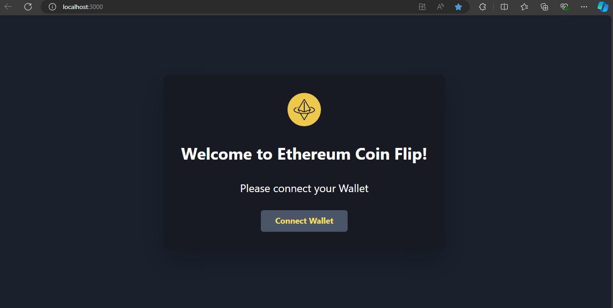
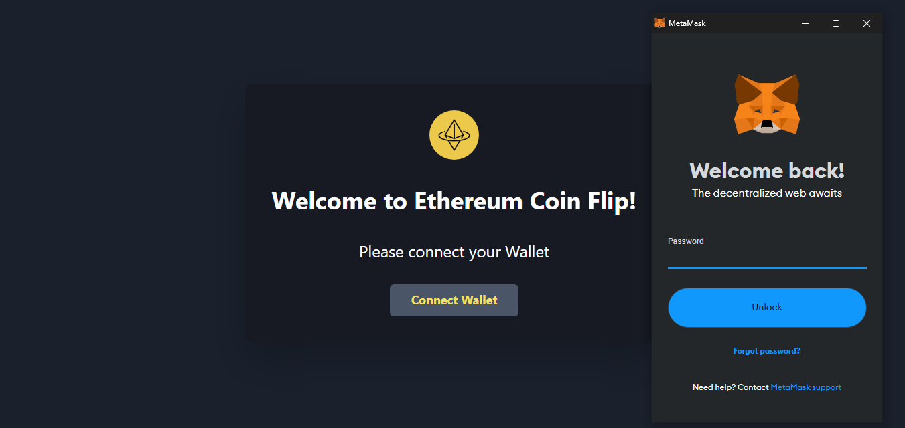
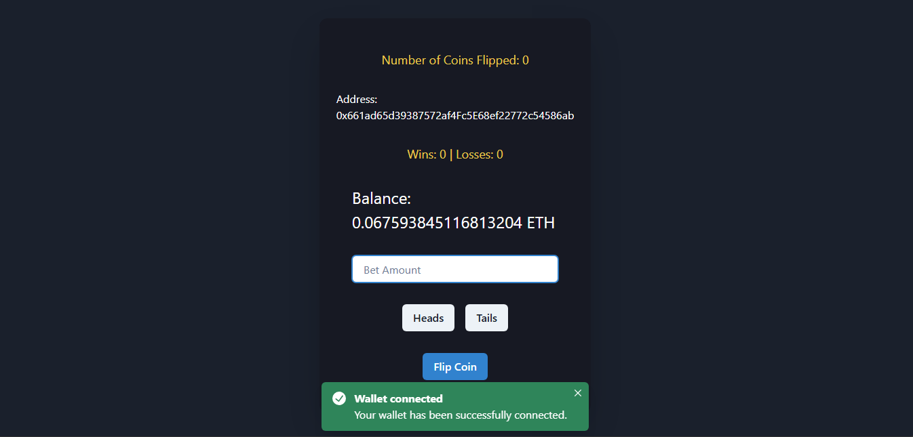
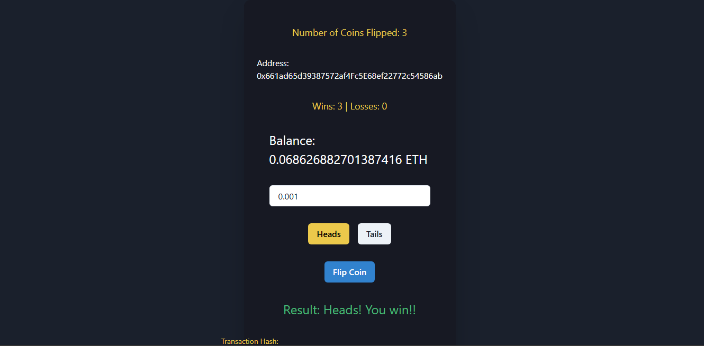

# CoinFlip 

A CoinFlip project is for flipping a coin on the Ethereum blockchain. Users can connect their MetaMask wallet, place a bet, and flip a coin to win or lose Ether.

## Table of Contents
Overview
Features
Installation
Usage
Deployment
Screenshots

### `Overview`

CoinFlip is a simple blockchain-based game where users can bet Ether on the outcome of a coin flip. If the user wins, they receive double their bet amount. The application is built with React and uses Ethereum smart contracts for transaction handling.

### `Features`

Connect wallet using MetaMask
Place bets in Ether
Flip a coin to win or lose
View transaction details on Etherscan

### `Technologies Used`

- **React**: For building the user interface.
- **Chakra UI**: For styling and UI components.
- **Ethers.js**: For interacting with the Ethereum blockchain.
- **Hardhat**: For smart contract development and deployment.
- **MetaMask**: For wallet connection and transaction handling.
- **Infura**: For connecting to the Ethereum network.
- **Solidity**: For writing smart contracts.

### `Installation`

git clone https://github.com/yourusername/coinflip.git ,
cd coinflip ,
npm install

### `Usage`

Start the Development Server:
bash
npm start

Open the Application:
Open your browser and navigate to http://localhost:3000 to access the CoinFlip.
Connect Wallet:
Click on "Connect Wallet" to connect your MetaMask wallet.
Place a Bet:
Enter the amount of Ether you want to bet and select "Heads" or "Tails."
Flip the Coin:
Click on the coin image to flip the coin and see if you win or lose.

### `Deployment`

The application is deployed at: [Deployment Link ](https://coinflip-chi-cyan.vercel.app/)

** To learn React, check out the [React documentation](https://reactjs.org/).**

### `Screenshots`

1. **Initial Screen - Add Wallet:**

   

2. **Connect with MetaMask:**

   

3. **Flip a Coin:**

   

4. **Win or Loss Result:**

   
